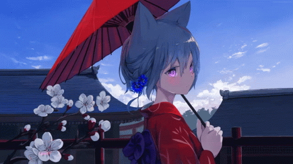

## About ME
### Hi there My Name Fariz, Student in Makassar University State in Indonesia 👋

###

  
  

### My Project
 

### My Skills

  

### Tools

  

### Connect With MY:

 

### My Github Stats
  

### 🏆 GitHub Trophies

<picture>
  <source media="(prefers-color-scheme: dark)" srcset="https://raw.githubusercontent.com/DevXray/DevXray/output/pacman-contribution-graph-dark.svg">
  <source media="(prefers-color-scheme: light)" srcset="https://raw.githubusercontent.com/DevXray/DevXray/output/pacman-contribution-graph.svg">
  
</picture>

